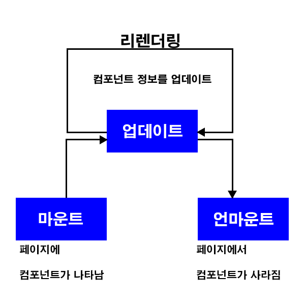

## 라이프사이클 메서드란
- 라이프사이클 메서드의 종류는 총 9가지이다.
<table>
    <thead>
    </thead>
    <tbody>
        <tr>
            <th>Will</th>
            <td>어떤 작업을 실행하기 전에 실행되는 메서드</td>
        </tr>
        <tr>
            <th>Did</th>
            <td>어떤 작업을 실행한 후에 실행되는 메서드</td>
        </tr>
    </tbody>
</table>

    

## 마운트
- DOM이 생성되고 웹 브라우저상에 나타나는 것을 마운트(Mount)라고 한다.
- 마운트가 이루어 질 때 호출되는 메서드
<section style="border:1px solid #000; text-align:center;">
    
컴포넌트 만들기

    
▼

    
consturctor

    
▼

    
getDerivedStateFromProps

    
▼

    
render

    
▼

    
componentDidMount

</section>

<table>
    <thead>
    </thead>
    <tbody>
        <tr>
            <th>consturctor</th>
            <td>컴포넌트를 새로 만들 떄마다 호출되는 클래스 생성자 메서드</td>
        </tr>
        <tr>
            <th>getDerivedStateFromProps</th>
            <td>props에 있는 값을 state에 넣을 때 사용하는 메서드</td>
        </tr>
        <tr>
            <th>render</th>
            <td>우리가 준비한 UI를 랜더링하는 메서드</td>
        </tr>
        <tr>
            <th>componentDidMount</th>
            <td>컴포넌트가 웹 브라우저상에 나타난 후 호출되는 메서드</td>
        </tr>
    </tbody>
</table>

## 업데이트
- 업데이트 되는 경우 4가지
    - props가 바뀔 때
    - state가 바뀔 때
    - 부모 컴포넌트가 리렌더링 될 때
    - this,forceUpdate로 강제로 렌더링을 트리거할 때

<section style="border:1px solid #000; text-align:center;">
    
업데이트를 발생시키는 요인
    

        props 변경
        state 변경
        부모 컴포넌트 리렌더링
    

    

    
▼

    
getDerivedStateFromProps

    
▼

    
shouldComponentUpdate

    
▼

    
true 반환 시 render 호출, false 반환시 여기서 작업 종료

    
▼

    
render

    
▼

    
getSnapshotBeforeUpdate

    
▼

    
웹 브라우저상의 실제 DOM 변화

    
▼

    
componentDidUpdate

</section>

<table>
    <thead>
    </thead>
    <tbody>
        <tr>
            <th>getDerivedStateFromProps</th>
            <td>마운트과정에서도 업데이트가 시작하기 전에도 호출되는 메서드. props의 변화에 따라 state값에도 변화를 주고싶을 떄 사용한다.</td>
        </tr>
        <tr>
            <th>shouldComponentUpdate</th>
            <td>컴포넌트가 리렌더링을 해야할 지 말아야 할지를 결정하는 메서드. 이 메서드는 true/false값을 반환해야하며 true를 반환 시 다음 라이프사이클 메서드를 계속 실행하고, false를 반환시 작업을 중지한다. 즉 컴포넌트가 리렌더링 되지 않는다. 만약 특정함수에서 this.forceUpdate() 함수를 호출한다면 이 과정을 생략하고 바로 render함수를 호출한다.</td>
        </tr>
        <tr>
            <th>render</th>
            <td>컴포넌트를 리렌더링한다.</td>
        </tr>
        <tr>
            <th>getSnapshotBeforeUpdate</th>
            <td>컴포넌트 변화를 DOM에 반영하기 바로 직전에 호출하는 메서드</td>
        </tr>
        <tr>
            <th>componentDidUpdate</th>
            <td>컴포넌트의 업데이트 작업이 끝난 후 호출하는 메서드</td>
        </tr>
    </tbody>
</table>

## 언마운트
- 마운트의 반대 과정, 즉 컴포넌트를 DOM에서 제거하는 경우를 말한다.
<section style="border:1px solid #000; text-align:center;">
    
언마운트하기

    
▼

    
componentWillUnmount

</section>

<table>
    <thead>
    </thead>
    <tbody>
        <tr>
            <th>componentWillUnmount</th>
            <td>컴포넌트가 웹 브라우저상에서 사라지기 전에 호출하는 메서드</td>
        </tr>
    </tbody>
</table>